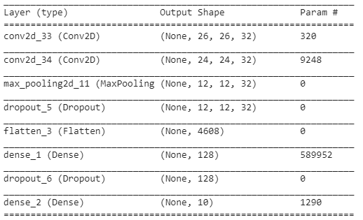

# Siamese-Network-with-Triplet-Loss

This project contains two sections.

* The first part uses a parallel feature model to prodeuce an embedding representation of the Mnist dataset the model is trained using triplet loss this function aims to force the image towards other images in it's class and further away from images in other classes.

* The second part uses a pre trained network, more specficaly a fine tuned version of the VGG16 convolutional network trained on facial images to produce an embeddind representation of a number of celebrity faces to produce a simple retrival system.

