# Siamese-Network-with-Triplet-Loss

This project contains two sections.

* The first part uses a parallel feature model to prodeuce an embedding representation of the Mnist dataset the model is trained using triplet loss this function aims to force the image towards other images in it's class and further away from images in other classes.

* The second part uses a pre trained network, more specficaly a fine tuned version of the VGG16 convolutional network trained on facial images to produce an embeddind representation of a number of celebrity faces to produce a simple retrival system.

## Part One.

A triplet loss network was implemented in Python using the Keras framework and a skeleton file provided by Dr. McDermott that demonstrated the structure and methodology of a triplet loss network. This code already provided functions to load the MNIST dataset and generate triplet batches. However to complete the network, an embedding model and a loss function had to be created. A simple embedding model was created that received a single 28x28 RGB image and outputted a dense vector of length ten. The model only contained two convolutional layers as a sufficient accuracy level was achieved.

  

Using the lecture notes; the equation for the triplet loss was translated to a Keras tensor friendly format. This function minimizes the loss between embedding’s of a similar class by minimizing  the distance from the anchor to positive embedding whilst maximizing distance from the negative and anchor. The alpha/margin value makes sure that the network is not allowed to output the trivial solution where all embedding’s vectors are zero or contain the same values. The impact of this parameter can be seen in figure (1) where the alpha value is varied from 0 to 1. From this figure the resulting embedding’s improve from the trivial solution as the margin is increased. The margin essentially defines a minimum threshold between the positive and the negative images. Thus as the margin is increased the total number of triplets generated whose loss is actually greater than zero decreases therefore they do not contribute to the training of the model thus reducing the accuracy of the outputted embedding’s. Also with higher alpha values the embedding clusters are created much tighter however the clusters themselves are more densely packed together. Despite this a value of 0.4 was chosen for the remainder of the assignment. Below is the code for the triplet loss function implemented in keras.

  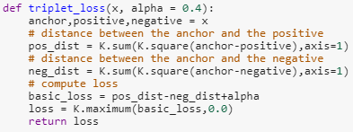

The model was then compiled and trained on the MNSIT dataset using the batch generator provided. Below is a graph of the training and validation losses as a function of epoch. 

  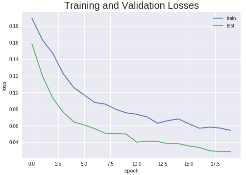

In order to create a recognition function, that not only distinguishes between the classes in the MNIST dataset but also classifies if an image is an integer or a digit, a new model had to created. The problem with the previous model was that it had an input of three RGB images and it’s triplet loss function didn’t use the class labels to update the gradients. 
To overcome the first problem; and output a single embedding for a single image, the weights of the model had to be saved and uploaded to a new model that had the same structure as the embedding model but with a input dimension that corresponded to a single image and not a triplet. Below is the implementation of this new embedding model.

  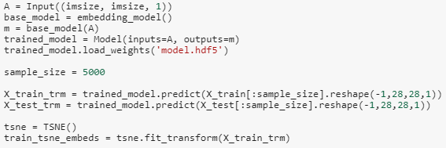

5000 images where then passed through this pre-trained network and their embedding’s were calculated. Using dimensionality reduction a 2d visualization of the embedding’s was created where the color and text indicate the class of a point or cluster. From the visualization below we can see that the model has been trained correctly, as embedding’s of the same class have formed clusters in vector space.  

  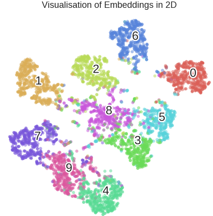

A clustering algorithm would be able to split the image into 9 clusters however it would be unable to distinguish the label of a point as it is an unsupervised learning technique. Thus to compute the label of each embedding a simple classifier was created that accepted an embedding vector and translated this to a one hot encoded label. As the embedding vectors have already encompassed the class of each image the model was extremely simple containing just an Input and a softmax output layer. After training the model with the target one hot encoded vectors an accuracy level of 88% was achieved.

  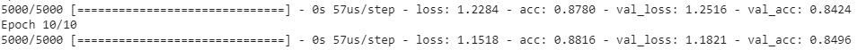

It was observed that when passing a non-digit image through the classification algorithm that the distribution of the softmax probabilities were essentially confined to a single array element. Whereas, when presented with an actual MNIST image the probability distribution was more naturally spread between elements.

  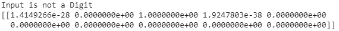

  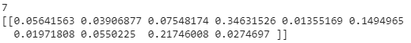

To exploit this, a function that computes the Gini coefficient of an array was created. The Gini coefficient is a statistical measure of a distribution that is usually used in economics to compute economic inequality. This value was computed for both the digit and non-digit images, and a threshold was then manually set. Thus any array with a Gini coefficient above 0.87 was classified as a non-digit image. This approach correctly classified the MNIST classes with 84% accuracy and was 99% successful in discerning a digit from the hand drawn letter images provided.

  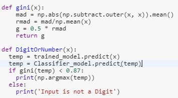

## Part Two.

In part two, the pre-trained weights from the VGG Face description model were used to create a vector representation of a number of chosen facial images. This model was developed by academics at oxford university that fined tuned the standard VGG architecture (16 convolutional layers with max pooling and dropout ;) by feeding the model dedicated training-set images for face recognition. The image set used within this report contained 71 images of 5 celebrities the distribution of which is defined below.

  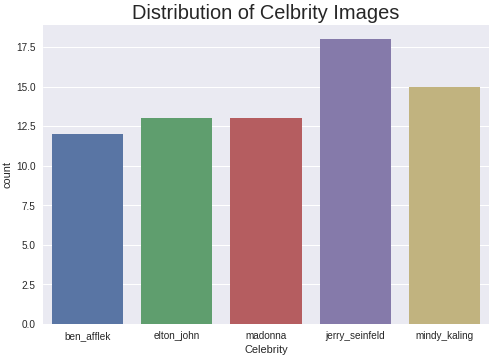

The original images were preprocessed using Haar cascade image object detection. To extract just the face of the celebrity from each image. These new cropped images where then saved to a directory for later use. Each filtered image was then passed through the pre-trained model with the final layer removed to produce an embedding. Using the TSNE dimensionality reduction method provided by Scikit learn package these embedding were then converted into two dimensions and visualized.

  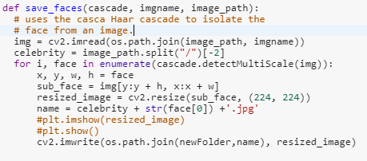

The image below demonstrates the improved accuracy between the standard VGG16 model trained on the ImageNet dataset and the fine-tuned VGG face net model. The image on the right hand side contains clearly defined clusters in the embedding space for each celebrity. In comparison the standard model does capture some information such as Elton John and Madonna however the clusters are much less defined. 

  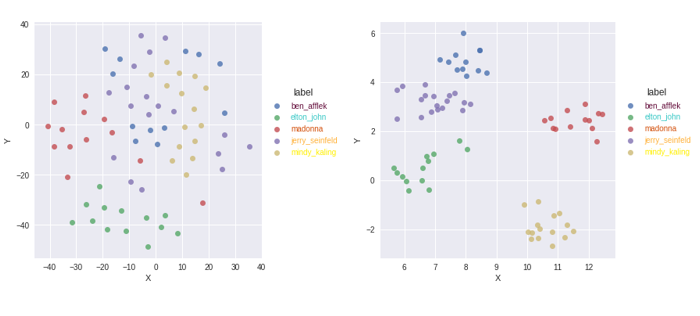

